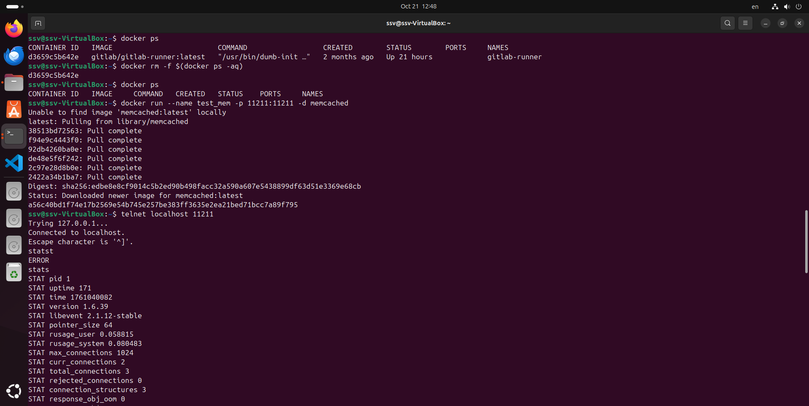
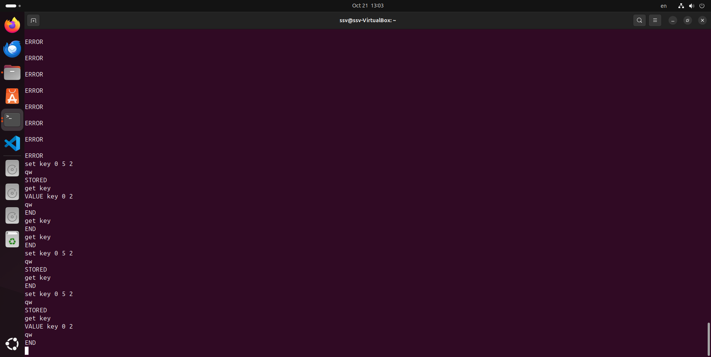
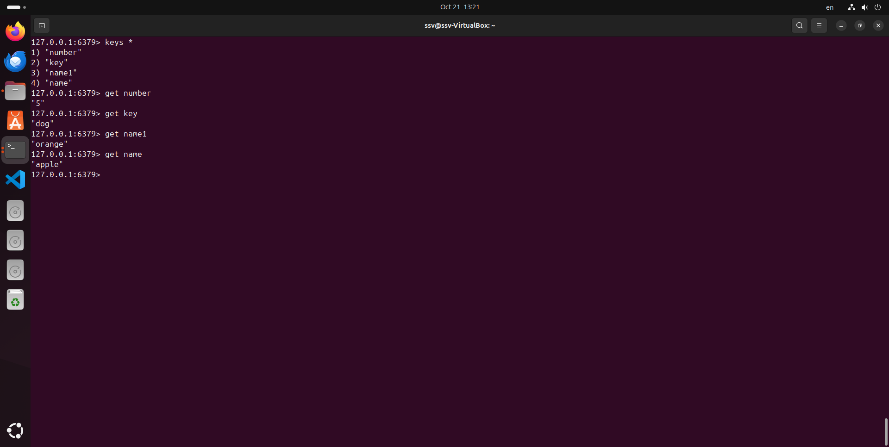
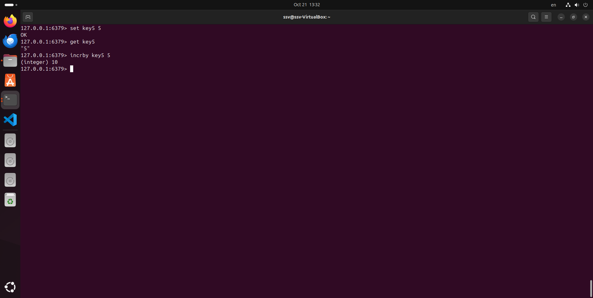
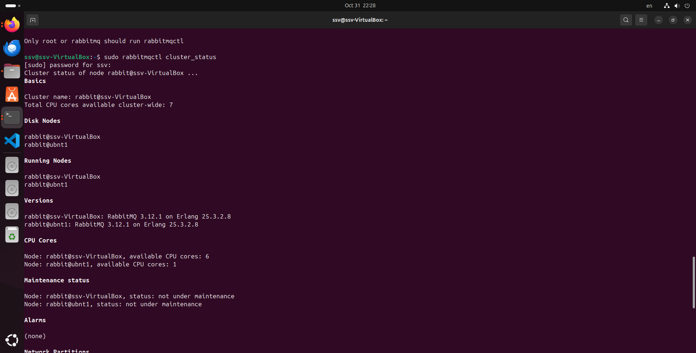

# Домашнее задание к занятию 3 «Резервное копирование», Самсонов СВ

### Задание 1

Команда и результат

продолжение

продолжение

### Задание 2

Добавление скрипта в cron

результат работы скрипта

запись в системном журнале

