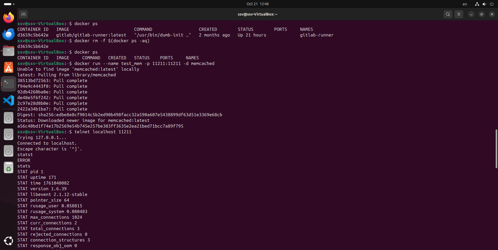
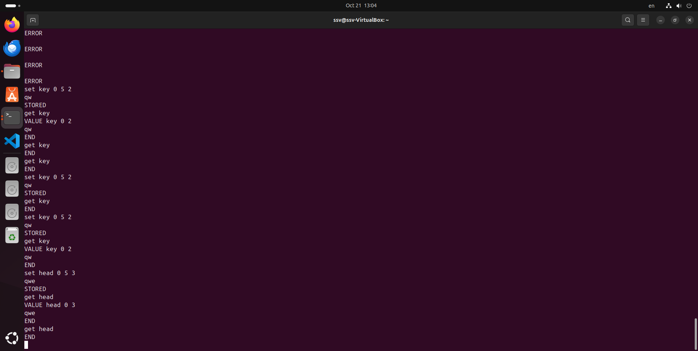
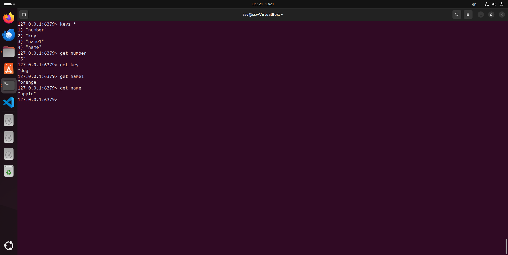
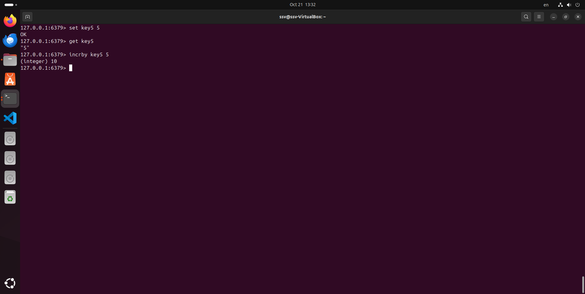

# Домашнее задание к занятию «Кеширование Redis/memcached», Самсонов СВ

### Задание 1. Кеширование

Приведите примеры проблем, которые может решить кеширование.

Ответ:
- Ограниченная пропускная способность сети - Кэш уменьшает количество сетевых запросов, экономя трафик и ускоряя ответ
- Высокая нагрузка на базу данных - Часто запрашиваемые данные (например, профиль пользователя или список категорий) можно хранить в кэше. Повторные запросы не нагружают базу.
- Повторная загрузка статических файлов (музыка, изображения, видео) - Кэш браузера позволяет пользователю не загружать те же файлы повторно, ускоряя загрузку сайта.
- Медленный ответ базы - Сложные SQL-запросы или аналитика выполняются один раз, результат сохраняется в кэше и отдается мгновенно при повторных запросах.

### Задание 2. Memcached
Установите и запустите memcached.

### Задание 3. Удаление по TTL в Memcached
Запишите в memcached несколько ключей с любыми именами и значениями, для которых выставлен TTL 5.

### Задание 4. Запись данных в Redis
Запишите в Redis несколько ключей с любыми именами и значениями.

### Задание 5*. Работа с числами
Запишите в Redis ключ key5 со значением типа "int" равным числу 5. Увеличьте его на 5, чтобы в итоге в значении лежало число 10.

